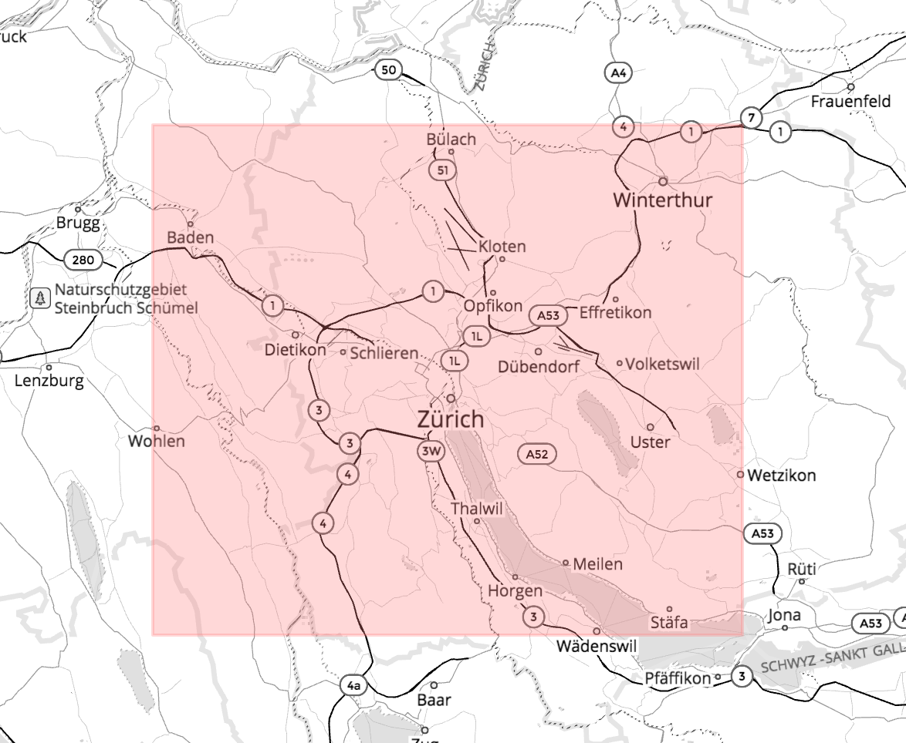
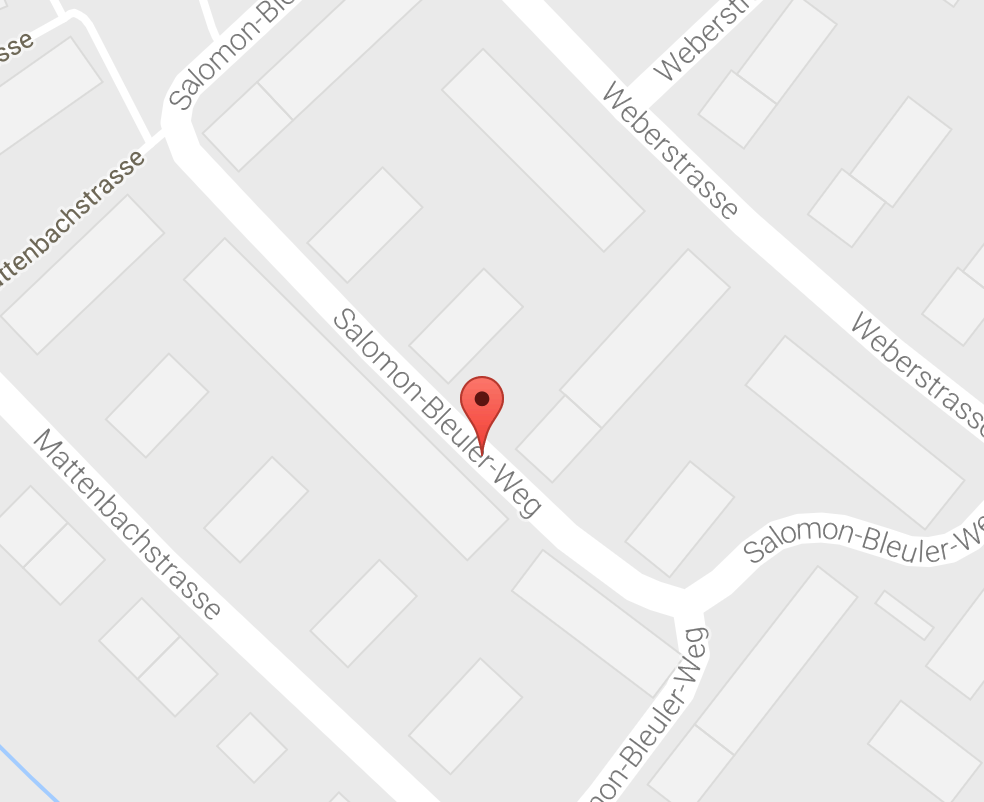
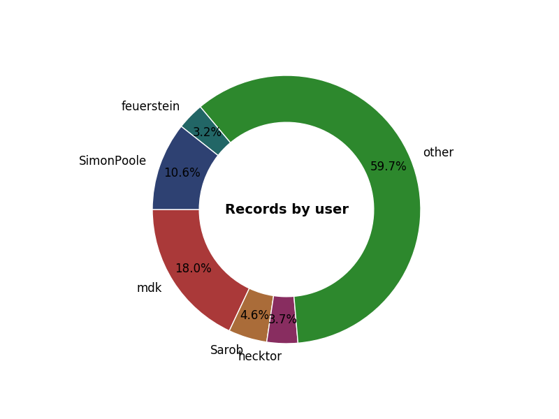

# Wrangle OpenStreetMap Data: Zurich, Switzerland

Project 3, Udacity Data Analyst Nanodegree

Contents:
- [Repository contents](#repository-contents)
- [Source data](#source-data)
  - [Parsing challenges](#xml-parsing-challenges)
    - [Domain/language knowledge](#domain--language-knowledge)
    - [City names](#city-names)
    - [Tag key separators](#tag-key-separators)
    - [Tag value separators](#tag-value-separators)
- [Data overview](#data-overview)
  - [File attributes](#file-attributes)
  - [Counts](#counts)
  - [Dates](#dates)
  - [Users](#users)
    - [Unique users](#unique-users)
    - [Top user](#top-user)
    - [Top 5 user activity](#top-five-users-vs-the-rest)
- [Zurich exploration](#zurich-exploration)
  - [Number of city-only records](#number-of-records)
  - [Top 5 amenities](#what-are-the-top-5-amenities)
  - [Most popular cuisine by postcode](#which-areas-of-the-city-have-the-most-diverse-cuisine)
- [Looking ahead](#looking-ahead)
  - [Payments](#payments)
  - [Limits of Zurich-only filter](#limits-of-addrcity)
- [Resources](#resources)


## Repository contents

Folder/file | Description
--- | ---
`extracts/` | contains osm and json sample data
`images/` | contains images used in this README
`clean_data.py` | master file for OSM XML sanitization
`insert_data.py` | master file for inserting sanitized json data into MongoDB
`process_sample.py` | generate `zurich_larger_extract.osm` for sanitization testing
`user_viz.py` | generate donut chart to visualize top user activity
`zurich_cities.py` | strategy file for auditing cities in the data

*Note: complete data files (both source `.osm` and sanitized `.json`) have been added to .gitignore to prevent slowness and bloating on GitHub.*

## Source data



The OpenStreetMap (OSM) extract for Zurich, Switzerland covers the city center and surrounding suburbs, and contains data on establishments, transportation systems, points of interest, and more for the area. The **[OSM XML dataset from MapZen](https://mapzen.com/data/metro-extracts/metro/zurich_switzerland/) is 614.7 MB**.

In accordance with the OSM XML API, the data consists of three main types of elements:

- Nodes
- Ways
- Relations

In the sanitization process, all three types of elements are accounted for.

### XML parsing challenges

#### Domain & language knowledge

I chose to parse Zurich data because of an interest in the city, not a personal connection. Having never visited or lived in Zurich and not knowing German, I was initially lacking knowledge to audit tag values.

Because of special characters in German (e.g. umlaut), I needed to familiarize myself with [Python's handling of unicode](https://docs.python.org/2/howto/unicode.html).


#### City names

Because of the umlaut in Zürich and the presence of city/district modifiers, the city names needed to be audited.

Using the fuzzywuzzy string approximation library, here are the top 20 fuzzy matches to Zurich before sanitization. Within each tuple, the string represents the "addr:city" value, and the integer its match ratio: how good of a match it is to the root term, "Zurich."

```python
[('Zurich', 100), ('Zuerich', 92), ('zuerich', 92), ('Zürich', 91), ('zürich', 91), ('Egg bei Zürich', 82), ('Zürich-Flughafen', 78), ('Zürich 50 Oerlikon', 78), ('Zürich-Altstetten', 78), ('Zürich Gockhausen', 78), ('Muri', 68), ('Höri', 60), ('Forch', 55), ('Buchs', 55), ('Embrach', 46), ('Zumikon', 46), ('Zufikon', 46), ('Neerach', 46), ('Uerikon', 46), ('Seuzach', 46)]
```

Any city value with a score below 78 does not contain Zurich. Thus, to filter down to only Zurich (or city-unspecified) records, I used that ratio cutoff to cull documents that do not directly reference Zurich in "addr:city".

To add complexity, the dataset's "addr:city" values contained a handful of integers. These integers represent Zurich's districts, which are often [referenced by number](https://en.wikipedia.org/wiki/Subdivisions_of_Z%C3%BCrich). To standardize city names and keep only Zurich records, I decided to convert any integers I saw in the "addr:city" field into "Zurich".


#### Tag key separators

OSM records level of specificity in the key values in tags. In the json conversion process, it made the most sense to nest these attributes together, but the approach had to differ based on the tag. For the purposes of this exercise, I only processed two-tiered keys (one separator), and disregarded three-tiered keys.

Two-tier key types & conversions:
```xml
<tag k="addr:street" v="Bülach" />
<tag k="addr:street" v="Spitalstrasse" />

# converted to:
"addr": {
  "city": "Bülach",
  "street": "Spitalstrasse"
}
```
```xml
<tag k="wheelchair" v="limited"/>
<tag k="wheelchair:description" v="rund 50% der Fahrzeuge verkehren mit Niederflur-Einstieg"/>

# converted to:
"wheelchair": {
  "description": "rund 50% der Fahrzeuge verkehren mit Niederflur-Einstieg",
  "base_value": "limited"
}
```
```xml
<tag k="maxspeed" v="100"/>
<tag k="source:maxspeed" v="sign"/>

# converted to:
"maxspeed": {
  "source": "sign",
  "base_value": "100"
}
```

Also, some separators departed from the standard `:` separator, and had `.`, like `surface.material`.  

#### Tag value separators

I had to conduct research on the data to ensure that I was handling the data correctly. Take the following XML:

```xml
<tag k="destination" v="Bern;Chur;Luzern;Flughafen;Nordring-Zürich"/>
<tag k="source:maxspeed" v="sign"/>
<tag k="destination:symbol" v="airport"/>
...
<tag k="name" v="Salomon-Bleuler-Weg"/>
<tag k="highway" v="residential"/>
<tag k="maxspeed" v="30"/>
...
<tag k="bus:lanes" v="no|designated" />
```

`;`, `-`, and `|` all potentially act as separators.

The first portion with `"Bern;Chur;Luzern;Flughafen;Nordring-Zürich"` is meant to be separated, as all of those are towns/cities in Switzerland. The third is also a clear separator. Values are converted to `["Bern","Chur","Luzern","Flughafen","Nordring-Zürich"]` and `["no", "designated"]`.

Searches for `"Salomon-Bleuler-Weg"` on [other maps](https://www.google.com/maps/place/Salomon-Bleuler-Weg,+8400+Winterthur,+Switzerland/@47.4916183,8.7383565,18z/data=!4m5!3m4!1s0x479a9997ae1936e5:0xb2db2c6fd90d87eb!8m2!3d47.4915712!4d8.7395501), however, confirm that the value is indeed the full name of the street.




## Data overview

Note: the data is filtered down to Zurich proper, meeting the following conditions:
  - City name approximately "Zurich"
  - An integer representing a Zurich district number
  - No explicit city mentioned (i.e. no "addr:city" field in the document)

### File attributes

File | Type | Size
--- | --- | ---
`zurich_switzerland.osm` | Source | 614.7 MB
`just_zurich.json` | Sanitized | 702.2 MB


### Counts

Type | Count | Query
--- | --- | ---
All | 3146959 | `db.just_zurich.count()`
Nodes | 2706650 | `db.just_zurich.find({"type":"node"}).count()`
Ways  | 432670| `db.just_zurich.find({"type":"way"}).count()`
Relations | 134 | `db.just_zurich.find({"type":"relation"}).count()`

#### Dates

Type | Result | Query
--- | --- | ---
Oldest record | "2006-05-05T16:19:04Z" | `db.just_zurich.find().sort({"created.timestamp": 1}).limit(1)`
Newest record | "2017-03-11T13:48:07Z" | `db.just_zurich.find().sort({"created.timestamp": -1}).limit(1)`

#### Users

##### Unique users

\> `db.just_zurich.distinct("created.uid").length`

```javascript
2642
```

*Note: "created.user" is not a viable field for uniqueness in this dataset -- four usernames share the same id.*

\> `db.just_zurich.aggregate([{$group: {_id: {uid:"$created.uid"}, users: {$addToSet: "$created.user"}}}, {$project: {_id: 1,users: 1,num_users: { $size: "$users" }}}, {$match: {num_users: {$gt: 1}}}])`


```javascript
{ "_id" : { "uid" : "5351349" }, "users" : [ "Jan:", "Jan Huber" ], "num_users" : 2 }
{ "_id" : { "uid" : "5007203" }, "users" : [ "someone12345678", "ManuDroid94" ], "num_users" : 2 }
```


##### Top user

\> `db.just_zurich.aggregate([{$group: {_id:{"user": "$created.user","uid": "$created.uid"},count:{$sum:1}}},{"$sort": {"count": -1}},{"$limit": 1}])`

```javascript
{ "_id" : { "user" : "mdk", "uid" : "178186" },
  "count" : 566235 }
```

##### Top five users vs the rest

\> ` db.just_zurich.aggregate([{$group: {_id:{"user": "$created.user","uid": "$created.uid"},count:{$sum:1}}},{"$sort": {"count": -1}},{"$limit": 5}])`

```javascript
{ "_id" : { "user" : "mdk", "uid" : "178186" }, "count" : 566235 }
{ "_id" : { "user" : "SimonPoole", "uid" : "92387" }, "count" : 334879 }
{ "_id" : { "user" : "Sarob", "uid" : "1218134" }, "count" : 146217 }
{ "_id" : { "user" : "hecktor", "uid" : "465052" }, "count" : 117316 }
{ "_id" : { "user" : "feuerstein", "uid" : "194843" }, "count" : 102162 }
```




## Zurich exploration

For the purposes of this exercise, I'm only considering tags that explicitly list Zurich as a city as within Zurich.

#### Number of records
\> `db.just_zurich.aggregate([{"$match": {"addr.city": {"$exists": 1}}}, {$group:{_id:null,count:{$sum:1}}}])`

```javscript
22849
```

#### What are the top 5 amenities?

\> `db.just_zurich.aggregate([
  {"$match": {$and: [{"addr.city": {"$exists": 1}}, {"amenity": {"$exists": 1}}]}},
  {$group: {_id: "$amenity",count:{$sum:1}}},
  {"$sort": {"count": -1}},
  {"$limit": 5}])`

```javascript
{ "_id" : "restaurant", "count" : 327 }
{ "_id" : "car_sharing", "count" : 212 }
{ "_id" : "school", "count" : 67 }
{ "_id" : "place_of_worship", "count" : 64 }
{ "_id" : "cafe", "count" : 52 }
```
#### Which areas of the city have the most diverse cuisine?

\> `db.just_zurich.aggregate([{$unwind: "$cuisine"}, {$match:{$and: [{"addr.city": {"$exists": 1}}, {"amenity":"restaurant"}]}}, {$group:{_id: "$addr.postcode", cuisines:{"$addToSet":"$cuisine"}}},{$project: {_id: 1, cuisines: 1,num_cuisines: { $size: "$cuisines" }}}, {$sort: {num_cuisines: -1}}, {$limit: 3}])`


```javascript
{ "_id" : "8004",
  "cuisines" : [ "american", "vegetarian", "Bier, Bar", "japanese", "vietnamese", "international", "tea", "asian", "spanish", "kebab", "indian", "italian", "kosher", "coffee_shop", "lebanese", "cake", "burger", "regional", "vegan", "tapas", "chinese" ],
  "num_cuisines" : 21 }
{ "_id" : "8001",
  "cuisines" : [ "thai", "greek", "japanese", "sushi", "brazilian", "fish", "spanish", "indian", "asian", "bistro", "regional", "italian", "pizza" ],
  "num_cuisines" : 13 }
{ "_id" : "8005",
  "cuisines" : [ "burger", "greek", "turkish", "indian", "lebanese", "pizza", "italian", "regional", "international", "thai", "asian", "vegetarian", "american" ],
  "num_cuisines" : 13 }
```


## Looking ahead

### Payments

Currently, the payments schema looks like the following, where keys are descriptive and values are standardized:

```javascript
"payment" : {
		"notes" : "yes",
		"coins" : "yes",
		"cash" : "yes",
		"american_express" : "yes",
		"visa_electron" : "yes",
		"visa" : "yes",
		"mastercard" : "yes",
		"maestro" : "yes"
  }
```

With this schema, it is difficult to perform aggregations in the MongoDB framework. One can really only query the payments sub-document for counts, rather than form more complex queries.

> \> `db.just_zurich.aggregate([{"$match":{$and: [{"addr.city": {"$exists": 1}},{"payment": {"$exists": 1} } ] } }, {$group:{_id: null, "num_payments": {"$sum": 1} } }, {"$sort": {num_payments: -1}}, {"$limit": 10}])`

> Returns `{ "_id" : null, "num_payments" : 25 }`

Whereas:

> \> `db.just_zurich.aggregate([{"$match":{$and: [{"addr.city": {"$exists": 1}},{"payment": {"$exists": 1} } ] } }, {$group:{_id: "$payment", "num_payments": {"$sum": 1} } }, {"$sort": {num_cuisines: -1}}, {"$limit": 10}])`

> Returns `"_id" : { "coins" : "yes", "bitcoin" : "yes" }`, rather than payment types as intended.

In the future, I'd want to sanitize the payments field so that the structure for a given document follows this schema: `{"payments": ["notes", "visa", "bitcoin"]}`.

### Limits of "addr:city"

My method for extracting Zurich-only data needs improvement. At the moment, the only filter I apply is through the "addr:city" key -- if the value doesn't fuzzy match to "Zurich", then I skip the record.

I loaded a non-filtered version of the dataset into MongoDB, and compared the counts of both collections:

Dataset | Count | Query
--- | --- | ---
Filtered | 3146959 | `db.just_zurich.count()`
Unfiltered | 6084959 | `db.all_zurich.count()`

Despite culling around 3 million records, I don't do any checks for location other than "addr:city". In the future, I may consider using records' `lat` and `lon` keys to determine whether a document falls within what I consider to be the city boundaries. However, I anticipate that this approach would be computationally intensive, especially over 6 million records.

## Resources

- [OSM XML API Wiki](http://wiki.openstreetmap.org/wiki/OSM_XML#Contents)
- [Elementtree API](https://docs.python.org/2/library/xml.etree.elementtree.html)
- [Unicode & Python](https://docs.python.org/2/howto/unicode.html)
- [Permutations for "street" in German](http://www.acronymfinder.com/Stra%C3%9Fe-\(German%3A-Street\)-\(STR\).html)
- [District validator](https://www.inyourpocket.com/zurich/Zurichs-districts_71823f?&page=2)
- [Fuzzywuzzy](https://pypi.python.org/pypi/fuzzywuzzy)  string match
- [Donut chart](http://stackoverflow.com/questions/36296101/donut-chart-python)
